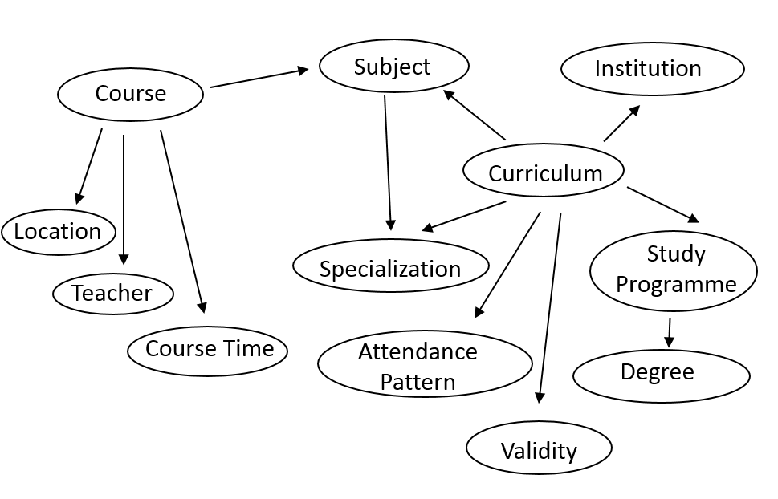

# OLOUD – Ontology for Linked Open University Data

The Ontology for Linked Open University Data (OLOUD) is a practical approach to model the education activities of a typical Hungarian university. OLOUD aims to integrate data from several sources and provide personal timetables, course-, subject-, curriculum information and other types of help for students and lecturers.

The following diagram summarizes the major concepts for university students and teachers in Hungary:


Though the Bologna Process ensures a certain level of compatibility for education systems in the EU, this does not reach deeper constructs of the educational model. We found that especially the meanings of course, subject and study programme are quite different in currently available models. A short summary of how these terms are interpreted in Hungarian education is the following.

After enrolling to the university each student is assigned to a Curriculum, which is a set of Subjects and their relations (i.e. dependencies among the subjects). Curriculum might specify Specializations which are sets of optional subjects. A Curriculum is in many-to-one relationship with a Study Programme (e.g. Computer Science Engineer), offered by the university. Each Curriculum has a specific Attendance Pattern (full-time, part-time, correspondence, etc.), and a result as a specific Degree (BSc, MSc, BA, MA, PhD, etc.). A Study Programme determines the qualification that a student will get after the successful completion of his studies. A Study Programme must be accredited by an external body. The curriculum is the specification how the Study Programme can be completed. A Curriculum is valid for a given time interval, meaning that a student can be assigned to it only if his enrollment time falls into this period of time. For each Subject there is an Organizational Unit responsible for it. Courses are advertised based on a Subject, have temporal (Course Time) and spatial (Location) attributes and one or more assigned Teacher(s). Additionally, learning materials (Learning Resource) can be assigned to specific courses and subjects.

In the case of Hungarian universities, it is crucial to understand the difference between Subjects and Courses. Course is the elementary unit of the educational process, where date, location, teacher and students are assigned. Course is the framework which has a specific training type (like lecture, practice or seminar) and has some requirements that students have to complete. Subject is a higher level component of the training process, it is the unit of the curriculum with a specified training content, and fulfillment is rewarded with a number of credits. It may contain more courses, which all must be completed for the completion of a subject.

The OLOUD ontology consists of two modules: [OLOUD-BASE](oloud-20160609.owl) and [OLOUD-TIME](oloud-time-20160609.owl). The former describes all the university related concepts, uses the prefix oloud and namespace http://lod.nik.uni-obuda.hu/oloud/oloud#. The latter provides the necessary classes and properties to describe course time data as recurring events, uses the prefix otime and namespace http://lod.nik.uni-obuda.hu/oloud/otime#. OLOUD also uses the [iLOC ontology](https://github.com/dsd-sztaki-hu/iLOC) for indoor navigation and indoor location description tasks.

## Papers about OLOUD

Fleiner, R., Szász, B., Micsik, A. (2017). OLOUD - An Ontology for Linked Open University Data. ACTA POLYTECHNICA HUNGARICA, 14(4), 63–82. http://doi.org/10.12700/APH.14.4.2017.4.4

```
@article{MTMT:3304250,
	title = {OLOUD - An Ontology for Linked Open University Data},
	url = {https://m2.mtmt.hu/api/publication/3304250},
	author = {Fleiner, Rita Dominika and Szász, Barnabás and Micsik, András},
	doi = {10.12700/APH.14.4.2017.4.4},
	journal-iso = {ACTA POLYTECH HUNG},
	journal = {ACTA POLYTECHNICA HUNGARICA},
	volume = {14},
	unique-id = {3304250},
	issn = {1785-8860},
	year = {2017},
	eissn = {1785-8860},
	pages = {63-82},
	orcid-numbers = {Micsik, András/0000-0001-9859-9186}
}
```

Szasz, B., Fleiner, R., Micsik, A. (2017). A case study on Linked Data for University Courses. LECTURE NOTES IN COMPUTER SCIENCE, 10034, 265–276. http://doi.org/10.1007/978-3-319-55961-2_27
```
@article{MTMT:3253922,
	title = {A case study on Linked Data for University Courses},
	url = {https://m2.mtmt.hu/api/publication/3253922},
	isbn = {9783319559605},
	author = {Szász, Barnabás and Fleiner, Rita Dominika and Micsik, András},
	doi = {10.1007/978-3-319-55961-2_27},
	journal-iso = {LECT NOTES COMPUT SC},
	journal = {LECTURE NOTES IN COMPUTER SCIENCE},
	volume = {10034},
	unique-id = {3253922},
	issn = {0302-9743},
	year = {2017},
	eissn = {1611-3349},
	pages = {265-276},
	orcid-numbers = {Micsik, András/0000-0001-9859-9186}
}
```

## SPARQL examples for OLOUD

The following SPARQL queries demonstrate the capabilities of the OLOUD ontology. Using FILTERs results can be limited to specific entities (rooms, courses, etc.), as the examples below return all data. You can use the files in the data folder as test data.

1. What are the courses for a given subject in a specific semester?

```
PREFIX oloud:<http://lod.nik.uni-obuda.hu/oloud/oloud#>

SELECT DISTINCT ?course WHERE {
  ?course a <http://purl.org/vocab/aiiso/schema#Course> .
  ?course oloud:courseSubject <http://lod.nik.uni-obuda.hu/data/NAIAB0SAND> .
  ?course oloud:courseTerm <http://lod.nik.uni-obuda.hu/data/2014Fall> .
}
```

2. On which day a given course is, what time does it starts and how long it is?

```
PREFIX oloud: <http://lod.nik.uni-obuda.hu/oloud/oloud#>
PREFIX ta: <http://ontology.ihmc.us/temporalAggregates.owl#>
PREFIX time: <http://www.w3.org/2006/time#>

SELECT DISTINCT ?course ?day ?beginhour ?beginminute ?durationhour ?durationminute WHERE {
  ?course a <http://purl.org/vocab/aiiso/schema#Course> .
  ?course oloud:courseTime ?ct .
  ?ct ta:hasTemporalAggregateDescription ?tad .
  ?tad ta:hasithTemporalUnit ?day ;
       ta:hasStart ?start .
  ?start time:hasDurationDescription ?dd ;
         time:hasBeginning ?begin .
  ?dd time:hours ?durationhour ;
      time:minutes ?durationminute .
  ?begin time:inDateTime ?begindatetime .
  ?begindatetime time:hour ?beginhour ;
                 time:minute ?beginminute .
}
```

3. What courses are at the same time partially or completely overlapping?

```
PREFIX oloud: <http://lod.nik.uni-obuda.hu/oloud/oloud#>
PREFIX ta: <http://ontology.ihmc.us/temporalAggregates.owl#>
PREFIX time: <http://www.w3.org/2006/time#>
prefix xsd: <http://www.w3.org/2001/XMLSchema#>

SELECT ?course1 ?course2 
{
?course1 oloud:courseTime ?ct1.
?ct1 ta:hasTemporalAggregateDescription ?ta1.
?ta1 ta:hasithTemporalUnit ?day;
	ta:hasStart ?s1.
?s1 time:hasBeginning ?begin1 ; 
    time:hasDurationDescription ?duration1.
?begin1 time:inDateTime  ?dt1 .
?dt1 time:hour ?hour1 ;
    time:minute ?minute1 .
?duration1 time:hours ?durationHour1;
 time:minutes ?durationMinute1.
?course2 oloud:courseTime ?ct2.
?ct2 ta:hasTemporalAggregateDescription ?ta2.
?ta2 ta:hasithTemporalUnit ?day;
	ta:hasStart ?s2.
?s2 time:hasBeginning ?begin2 .
?begin2 time:inDateTime  ?dt2 .
?dt2 time:hour ?hour2 ;
    time:minute ?minute2 .

BIND (xsd:integer(?minute1)+(xsd:integer(?hour1)*60) AS ?start1).
BIND (xsd:integer(?minute2)+(xsd:integer(?hour2)*60) AS ?start2).
BIND (xsd:integer(?durationMinute1)+(xsd:integer(?durationHour1)*60)+?start1 AS ?end1).
FILTER (?start1 < ?start2 && ?start2 < ?end1).
FILTER (?course1 != ?course2 ).
}
```

4. What is the course schedule (with course identifier, time and lecturer) for a specific lecture hall or lab?

```
PREFIX oloud: <http://lod.nik.uni-obuda.hu/oloud/oloud#>
PREFIX ta: <http://ontology.ihmc.us/temporalAggregates.owl#>
PREFIX time: <http://www.w3.org/2006/time#>
PREFIX iloc: <http://lod.nik.uni-obuda.hu/iloc/iloc#>

SELECT DISTINCT ?course ?room ?day ?beginhour ?beginminute ?teacher WHERE {
  ?room a iloc:Room.
  ?course oloud:locatedAt ?room;
          oloud:courseTeacher ?teacher;
          oloud:courseTime ?ct .
  ?ct ta:hasTemporalAggregateDescription ?tad .
  ?tad ta:hasithTemporalUnit ?day ;
       ta:hasStart ?start .
  ?start time:hasDurationDescription ?dd ;
         time:hasBeginning ?begin .
  ?dd time:hours ?durationhour ;
      time:minutes ?durationminute .
  ?begin time:inDateTime ?begindatetime .
  ?begindatetime time:hour ?beginhour ;
                 time:minute ?beginminute .
}
```

5. What are the required courses of a specific course?

```
PREFIX oloud: <http://lod.nik.uni-obuda.hu/oloud/oloud#>

SELECT DISTINCT ?dep WHERE {
  <http://lod.nik.uni-obuda.hu/data/NAIDR0SAND> oloud:subjectRequires ?dep
}
```

6. Navigate from the main entrance to a specific course location!

```
PREFIX oloud: <http://lod.nik.uni-obuda.hu/oloud/oloud#>
PREFIX iloc: <http://lod.nik.uni-obuda.hu/iloc/iloc#>
PREFIX rdfs: <http://www.w3.org/2000/01/rdf-schema#>

SELECT ?distance ?sl ?l1 ?l2 ?l3 ?el WHERE {
<http://lod.nik.uni-obuda.hu/data/AB0_EA_2014-15-1> oloud:locatedAt ?end
BIND (<http://lod.nik.uni-obuda.hu/data/PB01> AS ?start ).
OPTIONAL {?start rdfs:label ?sl.}
OPTIONAL {?p1 rdfs:label ?l1.}
OPTIONAL {?p2 rdfs:label ?l2.}
OPTIONAL {?p3 rdfs:label ?l3.}
OPTIONAL {?end rdfs:label ?el.}
?start iloc:connectsPOI ?p1.
?p1 iloc:connectsPOI ?p2.
?p2 iloc:connectsPOI ?p3.
?plast iloc:belongsToRoom ?end.
FILTER (?p3 = ?plast || ?p2 = ?plast || ?p1 = ?plast )
BIND (if( ?p3 = ?plast , 3, if( ?p2 = ?plast , 2, if( ?p1 = ?plast , 1, -1))) AS ?distance)
} ORDER BY ?distance LIMIT 1
```

7. What are the dates of the individual sessions of a given course?

```
PREFIX oloud: <http://lod.nik.uni-obuda.hu/oloud/oloud#>
PREFIX ta: <http://ontology.ihmc.us/temporalAggregates.owl#>
PREFIX time: <http://www.w3.org/2006/time#>

SELECT DISTINCT ?course ?day ?beginhour ?beginminute WHERE {
  ?course oloud:courseTime ?ct .
  ?ct ta:hasMember ?start .
  ?start time:hasDurationDescription ?dd ;
         time:hasBeginning ?begin .
  ?dd time:hours ?durationhour ;
      time:minutes ?durationminute .
  ?begin time:inDateTime ?begindatetime .
  ?begindatetime time:hour ?beginhour ;
                 time:minute ?beginminute .
}
```

8. What event is going to be at a specific location?

```
PREFIX oloud: <http://lod.nik.uni-obuda.hu/oloud/oloud#>
PREFIX ta: <http://ontology.ihmc.us/temporalAggregates.owl#>
PREFIX time: <http://www.w3.org/2006/time#>
PREFIX event: <http://purl.org/NET/c4dm/event.owl#>

SELECT DISTINCT ?event ?place ?day ?beginhour ?beginminute WHERE {
  ?event event:time ?t ;
         event:place ?place .
  ?t time:hasDurationDescription ?dd ;
         time:hasBeginning ?begin .
  ?dd time:hours ?durationhour ;
      time:minutes ?durationminute .
  ?begin time:inDateTime ?begindatetime .
  ?begindatetime time:hour ?beginhour ;
                 time:minute ?beginminute .
}
```
